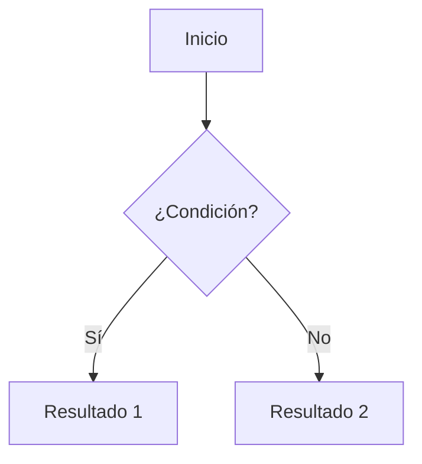

# Guía de referencia rápida de Markdown

Chuleta con los elementos más comunes de Markdown, cómo se escriben y qué extensión de **MkDocs Material** (o `python-markdown`) necesitas activar en tu `mkdocs.yml` para que funcionen. Los elementos "nativos" no necesitan nada especial.

---

## 1. Encabezados

```markdown
# Título H1
## Título H2
### Título H3
#### Título H4
```

**Requisitos:** ninguno (Markdown básico).

---

## 2. Énfasis (negrita, cursiva, tachado)

```markdown
*cursiva* o _cursiva_
**negrita** o __negrita__
***negrita y cursiva***
~~tachado~~
```

*cursiva* o _cursiva_
**negrita** o __negrita__
***negrita y cursiva***
~~tachado~~

**Requisitos:** el tachado (`~~texto~~`) necesita la extensión `pymdownx.tilde` (o `markdown.extensions.strike` según el procesador). En `mkdocs.yml`:

```yaml
markdown_extensions:
  - pymdownx.tilde
```

---

## 3. Listas

**Sin orden:**
```markdown
- Elemento 1
- Elemento 2
    - Subelemento
```

- Elemento 1
- Elemento 2
    - Subelemento

**Con orden:**
```markdown
1. Primero
2. Segundo
3. Tercero
```

1. Primero
2. Segundo
3. Tercero

**Requisitos:** ninguno.

---

## 4. Listas de tareas (checkboxes)

```markdown
- [x] Tarea completada
- [ ] Tarea pendiente
```

- [x] Tarea completada
- [ ] Tarea pendiente

**Requisitos:**
```yaml
markdown_extensions:
  - pymdownx.tasklist:
      custom_checkbox: true
```

---

## 5. Enlaces e imágenes

```markdown
[Texto del enlace](https://ejemplo.com)

```

**Requisitos:** ninguno.

---

## 6. Citas (blockquotes)

```markdown
> Esto es una cita.
> Puede tener varias líneas.
```

> Esto es una cita.
> Puede tener varias líneas.

**Requisitos:** ninguno.

---

## 7. Código

**Código en línea:**
```markdown
Usa la función `print()` para mostrar texto.
```

Usa la función `print()` para mostrar texto.

**Bloque de código con resaltado de sintaxis:**
````markdown
```python
def saluda():
    print("Hola mundo")
```
````

```python
def saluda():
    print("Hola mundo")
```


**Requisitos:** el resaltado de sintaxis en bloques necesita:
```yaml
markdown_extensions:
  - pymdownx.highlight:
      anchor_linenums: true
  - pymdownx.superfences
```

---

## 8. Tablas

```markdown
| Columna A | Columna B |
|-----------|-----------|
| Dato 1    | Dato 2    |
| Dato 3    | Dato 4    |
```

| Columna A | Columna B |
|-----------|-----------|
| Dato 1    | Dato 2    |
| Dato 3    | Dato 4    |

**Requisitos:**
```yaml
markdown_extensions:
  - tables
```
(en Material, muchas veces ya viene activada por defecto, pero es buena práctica declararla).

---

## 9. Líneas horizontales

```markdown
---
```

**Requisitos:** ninguno.

---

## 10. Notas / avisos / "tips" (admonitions)

```markdown
!!! note "Título opcional"
    Este es el contenido de la nota.

!!! tip
    Esto es un consejo.

!!! warning
    Esto es una advertencia.

!!! danger
    Esto es un peligro/alerta grave.
```

!!! note "Título opcional"
    Este es el contenido de la nota.

!!! tip
    Esto es un consejo.

!!! warning
    Esto es una advertencia.

!!! danger
    Esto es un peligro/alerta grave.

También existen en versión **colapsable**:

```markdown
??? note "Haz clic para expandir"
    Contenido oculto por defecto.
```

??? note "Haz clic para expandir"
    Contenido oculto por defecto.

**Requisitos:**
```yaml
markdown_extensions:
  - admonition
  - pymdownx.details   # necesario para las versiones colapsables (???)
```

---

## 11. Pestañas de contenido (tabs)

```markdown
=== "Python"
    ```python
    print("Hola")
    ```

=== "JavaScript"
    ```js
    console.log("Hola");
    ```
```

=== "Python"
    ```python
    print("Hola")
    ```

=== "JavaScript"
    ```js
    console.log("Hola");
    ```

**Requisitos:**
```yaml
markdown_extensions:
  - pymdownx.tabbed:
      alternate_style: true
```

---

## 12. Resaltado de texto (highlight) y subrayado

```markdown
==texto resaltado==
^^texto subrayado^^
```

==texto resaltado==
^^texto subrayado^^

**Requisitos:**
```yaml
markdown_extensions:
  - pymdownx.mark      # resaltado ==texto==
  - pymdownx.critic    # opcional, para marcado de cambios estilo "critic markup"
```

---

## 13. Subíndices y superíndices

```markdown
H~2~O
X^2^
```

H~2~O
X^2^

**Requisitos:**
```yaml
markdown_extensions:
  - pymdownx.caret   # superíndice ^texto^
  - pymdownx.tilde   # subíndice ~texto~ (la misma extensión del tachado)
```

---

## 14. Notas al pie

```markdown
Aquí hay una afirmación con nota al pie[^1].

[^1]: Esta es la explicación de la nota al pie.
```

Aquí hay una afirmación con nota al pie[^1].

!!! tip
    Para ver el resultado, tienes que bajar abajo del todo.


[^1]: Esta es la explicación de la nota al pie.

**Requisitos:**
```yaml
markdown_extensions:
  - footnotes
```

---

## 15. Emojis

```markdown
:smile: :rocket: :warning:
```

:smile: :rocket: :warning:

**Requisitos:**
```yaml
markdown_extensions:
  - pymdownx.emoji:
      emoji_index: !!python/name:material.extensions.emoji.twemoji
      emoji_generator: !!python/name:material.extensions.emoji.to_svg
```

---

## 16. Iconos y emojis de Material (específico de MkDocs Material)

```markdown
:material-heart: :fontawesome-brands-github:
```

:material-heart: :fontawesome-brands-github:

**Requisitos:** los mismos que el punto 15 (`pymdownx.emoji`), ya que Material reutiliza ese sistema para sus iconos.

---

## 17. Diagramas (Mermaid)

````markdown

````


**Requisitos:**
```yaml
markdown_extensions:
  - pymdownx.superfences:
      custom_fences:
        - name: mermaid
          class: mermaid
          format: !!python/name:pymdownx.superfences.fence_code_format
```

---

## 18. Bloques de contenido en columnas / grid (Material)

```markdown
<div class="grid cards" markdown>

- :rocket: **Rápido**

    Descripción de la tarjeta.

- :lock: **Seguro**

    Otra descripción.

</div>
```

<div class="grid cards" markdown>

- :rocket: **Rápido**

    Descripción de la tarjeta.

- :lock: **Seguro**

    Otra descripción.

</div>

**Requisitos:**
```yaml
markdown_extensions:
  - attr_list
  - md_in_html
```

---

## 19. Atributos personalizados (clases, IDs) en elementos

```markdown
{ width="300" }

Texto con una clase personalizada{: .mi-clase }
```

**Requisitos:**
```yaml
markdown_extensions:
  - attr_list
```

---

## 20. Definiciones (listas de definición)

```markdown
Término
:   Definición del término.
```

Término
:   Definición del término.

**Requisitos:**
```yaml
markdown_extensions:
  - def_list
```

---

## Resumen: bloque `markdown_extensions` completo recomendado

Si quieres activar prácticamente todo lo anterior de una vez, este sería un bloque típico para `mkdocs.yml`:

```yaml
markdown_extensions:
  - admonition
  - attr_list
  - def_list
  - footnotes
  - md_in_html
  - tables
  - pymdownx.details
  - pymdownx.superfences:
      custom_fences:
        - name: mermaid
          class: mermaid
          format: !!python/name:pymdownx.superfences.fence_code_format
  - pymdownx.highlight:
      anchor_linenums: true
  - pymdownx.tabbed:
      alternate_style: true
  - pymdownx.tasklist:
      custom_checkbox: true
  - pymdownx.tilde
  - pymdownx.caret
  - pymdownx.mark
  - pymdownx.emoji:
      emoji_index: !!python/name:material.extensions.emoji.twemoji
      emoji_generator: !!python/name:material.extensions.emoji.to_svg
```

> **Nota:** la mayoría de estas extensiones `pymdownx.*` vienen con el paquete `pymdown-extensions`, que se instala junto con `mkdocs-material` (`pip install mkdocs-material`). Si te da error de "extensión no encontrada", instala también: `pip install pymdown-extensions`.
